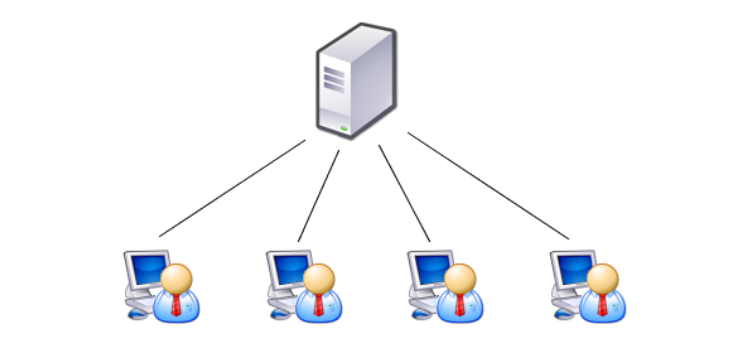
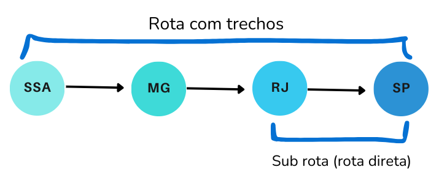

  <h1> VENDEPASS - Venda de Passagens </h1>
  <h3>Universidade Estadual de Feira de Santana</h3>
  <h3> TEC502 - MI Concorrência e Conectividade</h3>
  <h4>Letícia Teixeira Ribeiro dos Santos, Lucca de Almeida Hora Coutinho</h4>

## Introdução

    Este relatório descreve a implementação de um sistema de redes feito na linguagem de programação Python. O objetivo do sistema é a compra de passagens aéreas através de um servidor centralizado. Por meio da comunicação cliente-servidor utilizada, o usuário realiza operações como: fazer login, ver as rotas de tráfego aéreo, selecionar uma rota, escolher um assento e comprá-lo, cancelar passagem, além de poder ver as passagens já adquiridas. 

    Este artigo está dividido em Metodologia e Resultados e Conclusão. Nas próximas seções, é demonstrado as ferramentas utilizadas para a implementação do código-fonte, bem como apresenta os requisitos e funcionalidades do sistema, além dos resultados e conclusões do grupo responsável pelo desenvolvimento.

## Metodologia e Resultados

    Por decisão do grupo, a implementação do sistema foi feita na linguagem de programação Python em conjunto com o Docker, que permite o isolamento da execução do software e garante as mesmas condições de ambiente em qualquer computador. O editor de código-fonte utilizado foi o VSCode, junto com a plataforma auxiliar GitHub para colaboração mútua dos membros da equipe.

    As tomadas de decisões aconteceram durante sessões tutoriais, que é onde os grupos se reúnem para brainstorming e sanar as dúvidas em comum. As sessões de desenvolvimento, ocorridas no laboratório Laboratório de Redes e Sistemas Distribuídos (LARSID), contribuíram para transformar as ideias em código. 
    Nesta seção, os principais requisitos do problema são elencados bem como seus devidos cumprimentos. 

### Arquitetura da Solução

    A arquitetura desenvolvida foi a de cliente-servidor, comum em sistemas simples  de troca de mensagens via sockets TCP/IP. Os componentes dessa arquitetura são:

- **Cliente**: parte da arquitetura responsável por iniciar a comunicação com o servidor, e normalmente é operado pelo usuário. O cliente envia requisição ao servidor, por exemplo, o número da rota que deseja selecionar. Além disso, recebe a resposta do servidor e exibe ao usuário. 
- **Servidor**: Nesse problema, o servidor é central. Responsável por receber as requisições dos clientes, processar as informações e retornar uma resposta correspondente. O servidor lida com múltiplas conexões simultâneas e cada solicitação de cliente é tratada de forma independente, assegurando uma comunicação isolada.

    
     
    <b>Figura 1.</b> Representação do servidor central. <b>Fonte:</b> Internet.

- **Protocolo de comunicação (TCP/IP)**: garante a transmissão de dados entre cliente e servidor, utilizando sockets para enviar e receber mensagens. O papel desse componente é garantir a comunicação confiável e ordenada entre o cliente e o servidor, além de gerenciar a conexão, garantindo que os dados enviados cheguem corretamente e na ordem certa.
- **Lógica de negócios**: é o conjunto de regras e processos que definem como o servidor responde às solicitações dos clientes. Seu papel é interpretar o número enviado pelo cliente como uma operação específica, realizar a ação correspondente com base nessa operação e gerar a resposta que será enviada de volta ao cliente.

    Não foi utilizado um banco de dados para a persistência dos dados gerados, as informações são mantidas apenas durante o tempo de execução do servidor, exceto as rotas de voos que são pre-definidas em um arquivo Json.

### Paradigma de Comunicação

    O servidor foi implementado seguindo princípios <b>Stateful</b>, devido a ser um sistema mais simples com poucas operações disponíveis. De acordo a cada escolha do usuário, como por exemplo escolha de rota ou escolha de assento, uma requisição é enviada ao servidor, que responde de volta mantendo o contexto da requisição anterior até a finalização da compra.

### Protocolo de Comunicação

    De acordo aos requisitos solicitados, foi usado o protocolo de comunicação TCP/IP através de uma API socket nativa da linguagem Python. A interação inicia mediante login ou registro de acordo ao nome de usuário do cliente, seguindo para a escolha da operação através de um menu de opções numéricas.

### Formatação e Tratamento de Dados

    As mensagens trocadas entre o cliente e o servidor são no formato Json. O servidor envia os dados com a chave <i>“message”</i> como resposta para as operações que o cliente escolhe efetuar ou <i>“status”</i> para indicar que a conexão foi fechada por algum motivo, como escolha do próprio cliente ou tempo de inatividade. O cliente envia dados para o servidor com a chave <i>“option”</i> refletindo a opção numérica condizente com a operação que deseja realizar. 

### Tratamento de Conexões Simultâneas

    A realização das compras das passagens ocorre de forma simultânea, uma vez que o sistema é implementado com multithreading, onde cada thread trata uma conexão de um cliente. O sistema operacional alterna entre as threads, proporcionando a sensação de simultaneidade.

### Tratamento de Concorrência

    Foi identificado que, devido ao uso de threads, a concorrência poderia acontecer caso dois clientes diferentes tentem, ao mesmo tempo, comprar uma passagem para a mesma rota e mesmo assento ou tentem comprar para rotas que estejam contidas em outra, como por exemplo: RJ -> SP e SSA -> MG -> RJ -> SP, neste caso a primeira rota está contida na segunda, pois os segmentos RJ e SP correspondem a primeira rota.

    
     
    <b>Figura 2.</b> Exemplo de representação das rotas. <b>Fonte:</b> Os autores.

    Como tratamento foi utilizada a função <b>lock</b> disponível na biblioteca threading, que aplica o conceito de Mutual Exclusion (Mutex). Ao isolar um bloco de código com essa função, a primeira thread que alcançar aquele bloco irá impedir que outras também o alcancem, forçando-as a aguardar o bloco de código ser executado para depois tentarem acessar a região crítica. Isso evita que mais de uma thread modifique o mesmo recurso e gere inconsistências. No contexto do problema, a função foi aplicada no momento da reserva do assento e associação de passagem ao usuário que conseguir comprar, os outros clientes que tentarem comprar o mesmo assento na mesma rota no mesmo instante recebem uma mensagem de falha na compra.

### Desempenho e Avaliação

    Para avaliar o desempenho do sistema, foi criado um arquivo chamado script_client que é responsável por simular um cliente e conectá-lo ao servidor. Nesse script de teste, são criados 10 clientes que se conectam simultaneamente e realizam as mesmas operações. O intuito deste arquivo é testar as conexões simultâneas e a concorrência e verificar se todo o processo da lógica de negócios funciona corretamente para vários clientes interagindo ao mesmo tempo. 

    Sobre o resultado do arquivo de teste: quando é compilado, os 10 clientes simulados conectam-se ao servidor e fazem as mesmas requisições: selecionar uma rota e comprar o mesmo assento. Um detalhe importante é que na seleção da rota, há uma separação: clientes com números pares de identificação selecionam a rota 4 (com trechos) e os ímpares, a rota 3 (direta). No fim, apenas um cliente garante o assento (que é a opção em comum a todos), enquanto os outros usuários recebem a mensagem de que não é possível comprar aquele assento.

    Além disso, há um diretório _pycache_, que é gerado automaticamente pelo Python quando ele compila os arquivos .py em bytecode (arquivos .pyc) para acelerar a execução. Esses arquivos podem ser removidos sem causar problemas, mas serão recriados automaticamente na próxima execução do programa. No entanto, o cache gerado é somente para a classe user - que armazena as requisições feitas pelo usuário/cliente.

### Confiabilidade da Solução

    Dentre as características de confiabilidade da solução, uma delas é quando o servidor tiver um desligamento forçado (cair ou ter um cabo retirado), o cliente não realiza mais operações e é desconectado, recebendo uma mensagem de aviso. Dessa forma, o servidor é encerrado e não há continuidade se o cliente estiver em alguma operação, por exemplo. Será necessário o login do usuário novamente, para então realizar as funcionalidades.

    Dado um cenário com vários usuários utilizando o servidor ao mesmo tempo, fez-se necessário a utilização de um temporizador que não permite inatividade. Com o intuito de evitar uma sobrecarga no servidor, o sistema utiliza o timeout que contabiliza quanto tempo o cliente não realiza nenhuma requisição no sistema e desconecta-o por inatividade após 2 minutos sem realizar nenhuma ação.

## Conclusão

    Neste projeto, um sistema básico de cliente-servidor foi criado, utilizando o protocolo TCP/IP para estabelecer a comunicação. Isso possibilitou a interação eficiente entre vários clientes e o servidor. O funcionamento do sistema atendeu às expectativas, com a troca de mensagens ocorrendo de forma adequada.

    As principais funcionalidades foram colocadas em prática e os requisitos atendidos. Contudo, é possível aprimorar o tempo de resposta do sistema, o que pode ser alcançado com a implementação de um mecanismo de otimização baseado em filas ou usando Stateless como paradigma de comunicação, o que também contribui para uma melhor escalabilidade em momentos de alta demanda. Ademais, o teste de desempenho pode ser realizado de maneira mais aprofundada, especialmente se houver a necessidade de verificar o comportamento do sistema sob carga.

    O desenvolvimento deste sistema proporcionou, ao grupo, um aprendizado inicial sobre a arquitetura de comunicação em rede e o uso de sockets em ambientes cliente-servidor. Esse conhecimento poderá ser empregado em futuros projetos que envolvam comunicação distribuída ou sistemas distribuídos, contribuindo para a criação de soluções mais eficientes.

